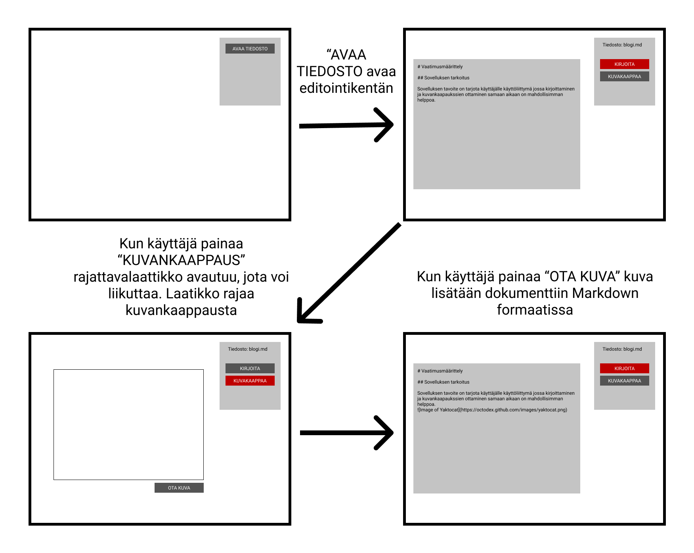

# Vaatimusmäärittely

## Sovelluksen tarkoitus

Sovelluksen tavoite on tarjota käyttäjälle käyttöliittymä jossa kirjoittaminen ja kuvankaapaukssien ottaminen samaan aikaan on mahdollisimman helppoa.

## Käyttäjät

Sovelluksella on vain yksi käyttäjärooli eli normikäyttäjä

## Käyttöliittymäluonnos

## Perusversion tarjoama toiminnallisuus

### Avaa tiedosto
- avaa mikä tahansa Markdown (.md) tiedosto

### Muokkaa tiedostoa
- tiedoston muokkaus onnistuu erillisessä ikkunassa
- dokumentti tallentuu automaattisesti

### Ota kuvan kaappaus
- nopea tapa ottaa kuva näytöstä
- lisää kuvan samaan kansioon kuin Markdown dokumentti
- lisää kuvan kuvan dokumenttiin Markdown muodossa

## Jatkokehitysideoita

- Voice to text - käyttäjä voi kirjoittaa puhumalla